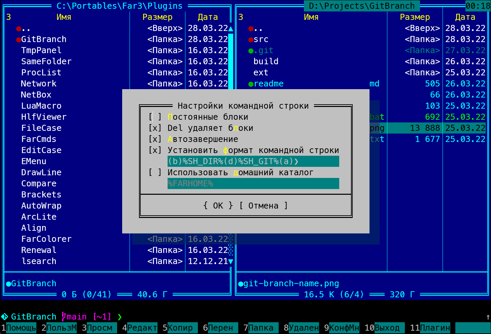

# GitBranch Far Manager plugin

Plugin helps Far Manager to show git branch at command prompt. It setups `%SH_G_BRANCH%,%SH_G_COMMIT%,%SH_G_STATE%,%SH_G_STATUS%`  and `%SH_DIR%,%SH_CMD_DURATION%` to git info for repository and directory on active panel. 
You should customize "Command line settings" to insert for example 
  `(3:7)%SH_DIR%(TFFCA00CA:7)%SH_G_BRANCH%(TFF66FF66:7)%SH_G_COMMIT%(E:7)%SH_G_STATE%(TFFD50005:7)%SH_G_STATUS%(TFF10930D:7)%SH_CMD_DURATION%(7)` 
in command line prompt format string. Branch name will be shown at command prompt:

**Git is not needed**

